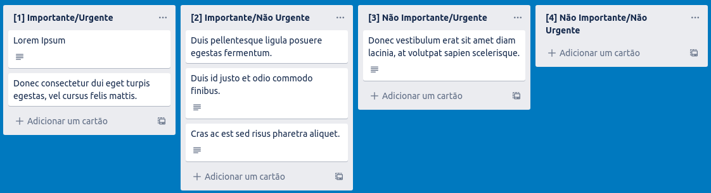
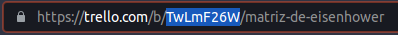

This is a [Next.js](https://nextjs.org/) project bootstrapped with [`create-next-app`](https://github.com/vercel/next.js/tree/canary/packages/create-next-app).

## Iniciando

Primeiramente você deve criar uma conta no [https://trello.com](https://trello.com) e em seguida criar um quadro, clique [aqui](https://trello.com/guide/create-project#create-a-board) para saber mais.
No seu novo quadro você deve criar quatro colunas numeradas com [1], [2], [3] e [4] no título, como no exemplo abaixo:



Entenda as regras de pontuação de suas tarefas neste artigo do [blog trello](https://blog.trello.com/br/matriz-de-eisenhower).

Agora com sua conta e quadro trello criados você precisa obter algumas informações de acesso para o sistema.

Encontre o arquivo ".env.example" na raiz do projeto e renomeie para ".env". Dentro desse arquivo, note que existem três variáveis não preenchidas:

1. TRELLO_KEY
2. TRELLO_TOKEN
3. BOARD_ID

Para recuperar os valores de TRELLO_KEY e TRELLO_TOKEN você deve seguir o passo a passo destes link [https://trello.com/app-key](https://trello.com/app-key).
Agora no arquivo ".env" você verá a seguinte variável:

PARAMS="key=TRELLO_KEY&token=TRELLO_TOKEN"

Basta ubstituir TRELLO_KEY e TRELLO_TOKEN pelos respectivos valores.

Agora, para recuperar o valor de BOARD_ID é bem simples, acesse seu quadro do trello e localize na URL da página o valor onde o exemplo abaixo destaca:



Pronto, com seu arquivo ".env" preenchido você já pode executar o projeto e visualizar suas tarefas no ponto de vista de Eisenhower.

## Executando o projeto

Inicie o servidor de desenvolvimento:

```bash
npm run dev
# or
yarn dev
```

Acesse [http://localhost:3000](http://localhost:3000) no seu navegador.
